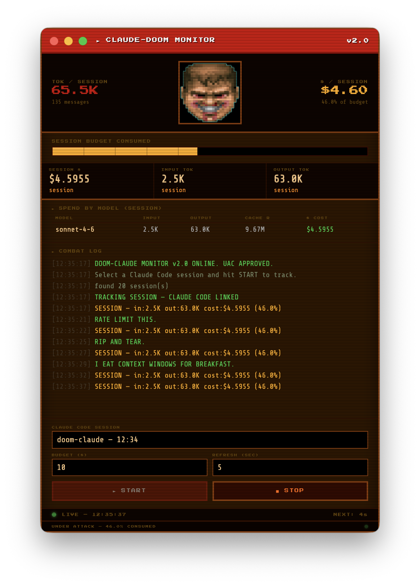

# DOOM-CLAUDE Monitor

Track your Claude Code session spend in real time — with DOOM Guy watching over your budget.



## What it does

Reads your Claude Code session files directly from `~/.claude/projects/` and tracks token usage and estimated cost as you work. DOOM Guy's face degrades as you burn through your budget.

## Requirements

- Node.js 18+
- [Claude Code](https://claude.ai/code) installed and used at least once

## Run

```bash
npm install
npm start
```

## Usage

1. Launch the app — it auto-selects your most recent Claude Code session
2. Set a budget (default $10)
3. Hit **START** — it polls every 10 seconds and updates live

## Damage states

| Budget consumed | DOOM Guy |
|---|---|
| 0–20% | Calm |
| 20–40% | Grinning |
| 40–60% | Hurt |
| 60–80% | Injured |
| 80%+ | Dying |

Click the face to taunt.

## Build

```bash
npm run build:mac   # macOS DMG
npm run build:win   # Windows installer
npm run build:linux # Linux AppImage
```

Output goes to `dist/`.

## How it works

- Scans `~/.claude/projects/` for session JSONL files
- Each Claude Code response includes token usage — input, output, cache read/write
- Cost is estimated using Anthropic's pay-as-you-go rates (useful even on subscription)
- No API key needed — reads local files only
